```{r setup, include=FALSE}
knitr::opts_chunk$set(echo = FALSE, warning = FALSE, message = FALSE)
```


# Labirinto de Dédalo

Uma percepção das prioridades do governo federal pode ser obtida por meio dos despesas efetuados pelo Tesouro Nacional e pela Previdência Social, especialmente quando se consegue separar a informação por área de atuação. Saúde, Educação e Defesa são algumas das dez áreas padronizadas internacionalmente para avaliar a destinação dos recursos públicos. O fio de Ariadne. 

Em sua maioria, os nomes são aparentemente autoexplicativos, como é o caso da Proteção Social, responsável pela maior parte do gasto do governo federal em 2019. Outras vezes, o título pode ser mais amplo, a exemplo de Serviços Públicos em geral, em que um olhar superficial pode não revelar a melhor informação. A única opção é entrar no labirinto. 

Se o Brasil tivesse um gasto total de R$ 100 em 2019, cerca de R$ 76 estariam alocados nessas duas categorias: Proteção Social e Serviços Públicos em geral. Seguindo essa lógica, aposentadorias da terceira idade e pensões, expressões mais evidentes da Proteção Social, representariam quase R$ 29 desse gasto. Por outro lado, de forma não tão intuitiva, o pagamento de aproximadamente R$ 22 com juros da dívida pública está contido em Serviços Públicos em geral, bem como por volta de R$ 12 transferidos para estados e municípios, a título de repartição obrigatória de recursos da federação brasileira. Desenrolando o novelo.

Todas as outras 8 áreas de atuação do governo federal dividiriam os R$ 24 restantes. Desse grupo, a Educação receberia R$ 7, sendo R$ 3,40 gastos com a educação superior, enquanto outros R$ 3 seriam transferidos aos estados e municípios para serem gastos com os primeiros níveis de ensino. A Saúde, destino de R$ 6,40 do total de R$ 100, tem uma dinâmica parecida, pois se transfere a maior parte desse recurso para ser executado pelos governos regionais, justificado pela responsabilidade do governo central em  organizar e financiar o Sistema Único de Saúde (SUS). Minotauro quase derrotado.

Diante dos R$ 10,70 que ainda restariam, Ordem Pública e Segurança, bem como Defesa, reuniriam mais da metade, ou seja R$ 5,70. Os gastos das cortes judiciais do País responderiam por R$ 2,60, enquanto a defesa militar ficaria com R$ 2. Já a área Assuntos Econômicos, responsável por temas relacionados à combustível e energia, agricultura, pesca, dentre outras atividades econômicas, receberia R$ 4,20. Sobraria menos de um real para as demais três funções. Portanto, se o gasto total fosse R$ 100, oitenta e três centavos seriam divididos por Habitação e Serviços Comunitários, Proteção Ambiental e Lazer, Cultura e Religião. O fio leva à saída do labirinto.  

A visão geral desses gastos aponta a primazia de algumas áreas de atuação, no entanto, parece revelar mais sobre o tamanho das obrigações do governo federal do que sobre suas prioridades. Teseu regressa a Atenas. Entretanto, ao combinar dados de insumos com os gastos de cada área, abre-se a possibilidade de explorar a forma com que o governo desempenha suas funções. Isso indicaria, por exemplo, em quais áreas o investimento ou a remuneração de empregados teriam maior destaque. Dédalo e seu filho Ícaro são aprisionados no labirinto.

Nas próximas sessões o fio de Ariadne é melhor detalhado. Apresentamos aqui as três sessões do aplicativo que explora os dados das despesas públicas a partir de uma visão econômica que é dado pela padronização internacional de gastos públicos reonhecida no manual COFOG.

# Fluxo de despesas

O fluxo de despesa permite compreender como os diversos sub-tipos de depesas se reúnem para formar os dez grupos principais e daí gerar o valor totalizador das despesas de governo.

Essa é uma figura típica desse fluxo de despesa

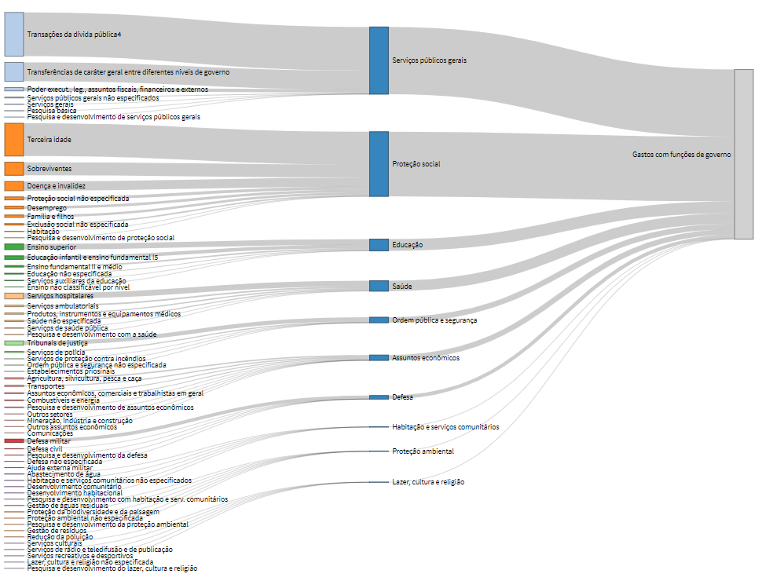

## Como usar o Fluxo de despesas

Comece seleicionando a aba correta. A primeira aba é aque contém esse texto. A segunda é a que você pode usar para explorar o fluxo de despesa. Veja a figura.


Agora é só escolher o ano no menu


E aí vcê vai ver o efeito da sua escolha no gráfico.

Experimente repousar o mouse sobre alguma faixa que liga as caixas dos fluxos. Você perceberá que o gráfico mostra o valor que sai de uma caixa para outra, tal como exemplificado na figura abaixo.


## Principais achados do Fluxo de despesas COFOG

O principal achado da avaliação ao longo dos anos da composicão da estrutura de despesas do governo é que não há mudança de ranking e há bem pouca variação nos percentuais de função e sub-função de governo.A única exceção é o ano de 2019 em que há uma inversão entre as duas despesas de maior volume. Essa mudança é explicada principalmente pela redução em pagamento de juros. Observe as duas figuras logo abaixo que mostram o fluxo para o ano de 2018 e em seguida o mesmo fluxo para o ano de 2019.

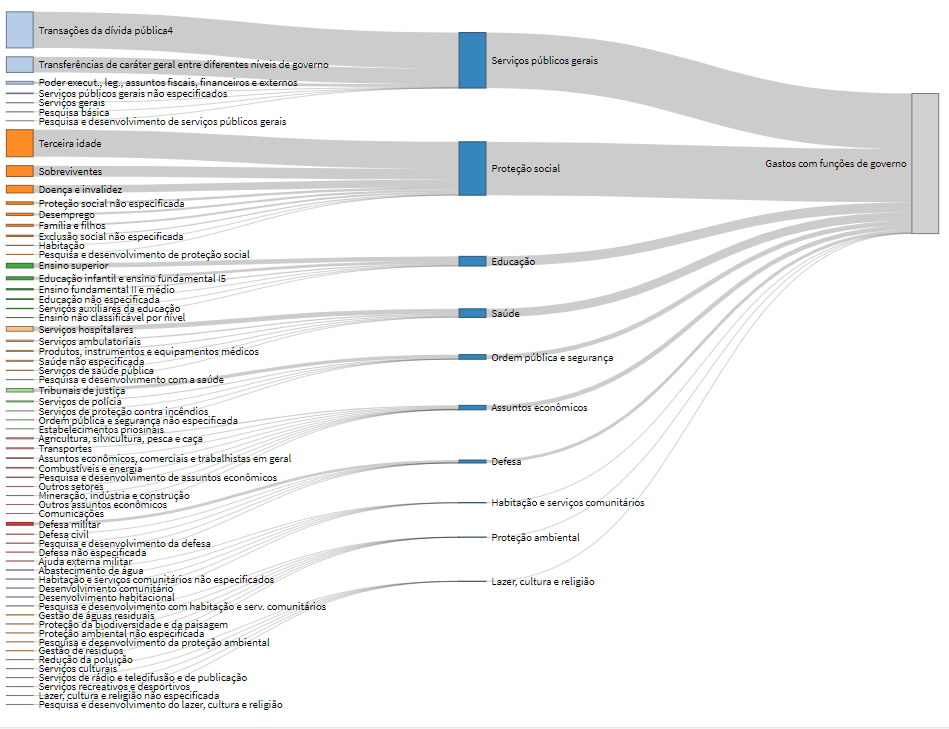

Fluxo para o ano de 2018

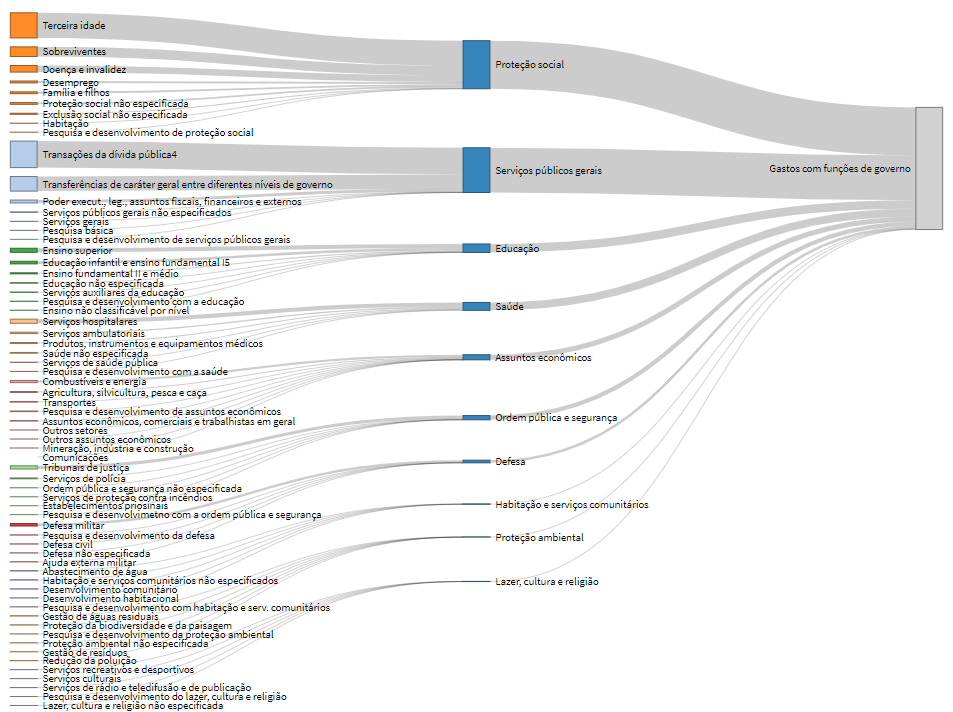

Fluxo para o ano de 2019

# Especificação das Despesas - Ação de governo

A terceira aba corresponde às análises sobre ações de governo


Nessa aba é mostrado como se dispersa as despesas nas diversas funções e nas ações de governo. O gráfico é montado levando em consideração que as despesas por ação de governo podem ser reunidos em três grupos de acordo com o valor total anual dispendido. Esses grupos são formados a partir de técnicas estatísticas podendo variar de tamanho e de composição a depender do ano selecionado.

Abaixo uma figura que ilustra esse gráfico.

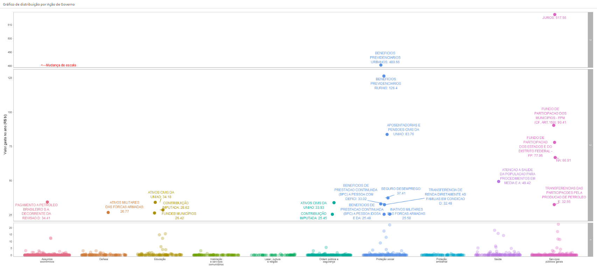

## Como explorar o gráfico de despesas por ação de governo.

Através do menu você pode selecionar o ano que deseja explorar. 


Há também a possibilidade de se indicar se você deseja dar um zoom nos dados relativos aos grupos 1 e 2 que podem ficar com visualização dificultada a depender do espaço no gráfico ocupado pelo grupo 3. 


O gráfico é inicialmente construído exibindo todas as ações de governo que caem nos grupos 2 e 3. Você pode limpar a qualquer momento a seleção das ações que são destacadas no gráfico usando o botão **Limpar Filtro**


Você pode selecionar as açoes que irão ser destacadas no gráfico. A figura abaixo mostra o comando do menu que permite isso. 


Observe na figura acima que as opcoes que são listadas estão separadas por uma barra vertical **|***. Essa barra separa as informações de: ação de governo, função de governo e grupo (1, 2 ou 3). Se você quiser que sejam listados nessa caixa as açoes do grupo 2, basta digitar 2 que a caixa vai informar quais são as ações nesse agrupamento. Em seguida, basta selecionar com o mouse as ações que lhe interessa.É importante frisar ainda que essa listagem está em ordem decresente do valor anual gasto por ação de governo. 

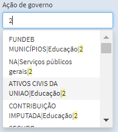

Dessa listagem, selecionamos a despesa com a ação de governo **Ativos Civis da União**. Veja abaixo como ficou o gráfico com atenção ao destaque da ação selecionada. Percebam ainda que é uma ação do grupo 2 e que está associada à função de governo **Educação**

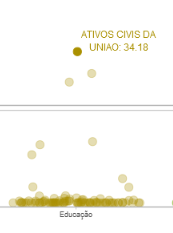


## Principais achados do gráfico de despesas por ação de governo

O que se percebe logo que se vê o gráfico é que duas ações de governo no grupo 3 dominam uma grande área do gráfico. As ações desse grupo são juros e benefícios previdenciários urbanos. A figura logo abaixo mostra essa predominância para o ano de 2019 onde houve uma queda proporcional das despesas com juros, conforme já indicado anteriormente.

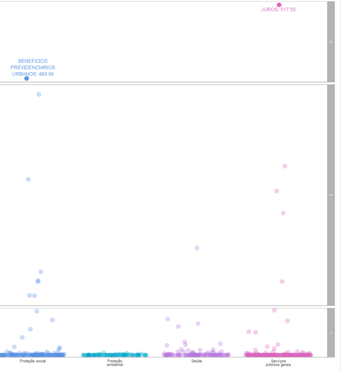

Se olharmos o mesmo gráfico para 2015, é notória que o valor pago em juros gera uma diferença muito grande entre as duas ações do grupo 3, fazendo com que a área destinada a esse grupo domine a maior parte do gráfico.

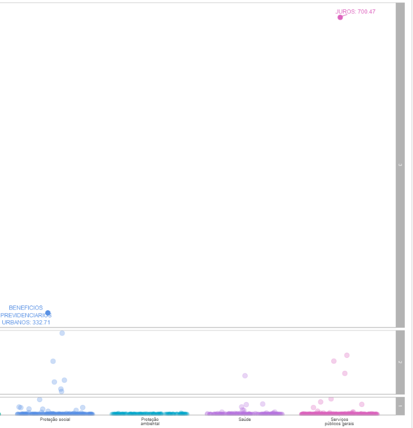

Essas duas ações são as principais causas da concentração das despesas respectivamente nas funções Serviços Públicos Gerais e Proteção social.

Convidamos o leitor a visitar essa aba do aplicativo para fazer outras explorações de dados e gerar novos achados.


# Especificação das despesas - Classificação econômica

A última aba trata de como os gastos são associados à classificação econômica.


Na classificação econômica a ideia é verificar como o total gasto por cada função é distribuído nas categorias econômicas de finanças públicas. A figura abaixo mostra um exemplo de exploração desse dado.

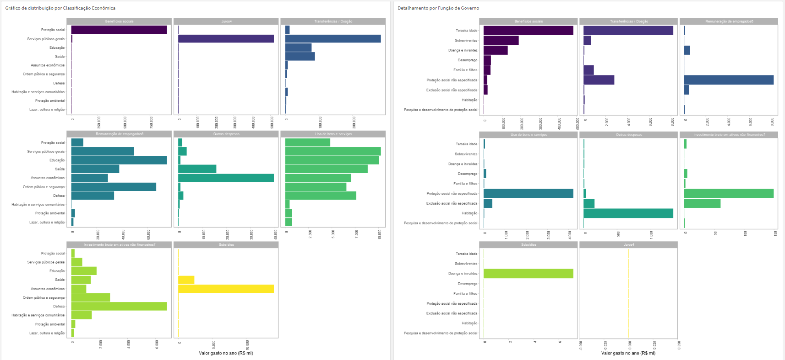

## Como explorar dados da classificação econômica.

Como nas demais abas desse aplicativo, comece aplicando o filtro de data.

Todos os gráficos são exibidos inicialmente com a mesma escala. Essa visualização é importante para se ter a percepção das grandezas dos valores gastos em cada classificação econômica. Por outro lado, não se permite ter a ideia do quanto as funções de governo se diferenciam umas das outras para cada classificação econômica, uma vez que a dominação da escala por uma classificação específica atrapalha a visualização das demais. Para isso, você pode escolher a opção **Escala livre**. Assim cada gráfico tem uma escala independente.


Os gráficos mais à direita na tela representam o detalhamento dos gastos por classificação econômica para uma dada função de governo. No menu você pode fazer a opção da função que deseja detalhar.


## Principais achados sobre classificação econômica

Sem marcar a opção de escala livre, fica muito claro que apenas três classificações econômicas dominam os gráficos. São elas: **Benefícios sociais, Juros e Transferência/Doação**. Quando se cruza essas três classificações com as funções de governo percebe-se que estão associadas a **Serviços Públicos Gerais, Proteção Social, Educação e Saúde**.

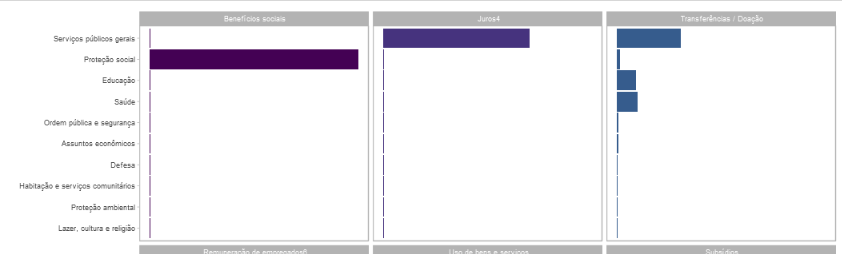

Já quando se opta pela marcação de escala livre, consegue-se fazer uma análise em despesas que são proporcionalmente muito baixas, mas que são de grande relevância para os debates econômicos. Vê-isso principalmente no caso dos valores de investimento. Veja a figura abaixo.

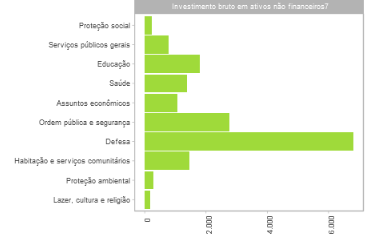

É interesante observar que quando exploramos os valores de investimento há um destaque para **Defesa**. Essa função conforme já visto no gráfico de fluxo tem em geral um volume muito pequeno de despesa quando comparado com as demais funções. Já quando se trata de investimentos percebe-se o seu protagonismo. A seleção dessa função para análise mais detalhada, permite descobrir que a maior parte das despesas está concentrada em **Defesa Militar**


# Transparência

* Download de Dados: As três abas possuem um link que permite que os dados sejam baixados de acordo com os filtros aplicados

* Dados Abertos: Os dados trabalhados nesse aplicativo estão disponíveis no portal Tesouro Transparente a partir deste [link](https://www.tesourotransparente.gov.br/ckan/dataset/despesas-por-funcao-do-governo-central-classificacao-cofog)

* Código Aberto:  O código para a construção deste aplicativo está disponível no botão **Source Code** no lado direito parte superior da tela.


